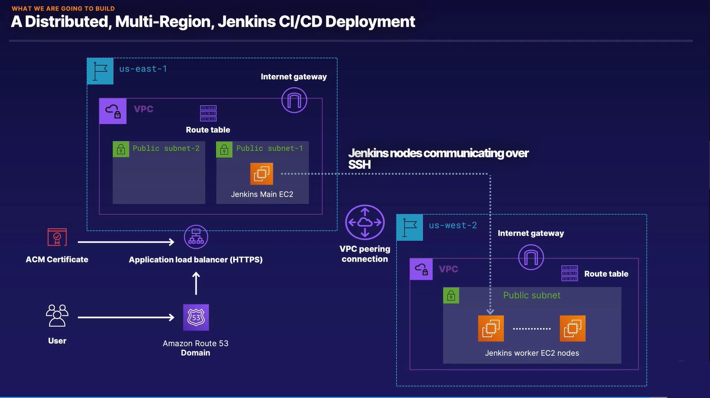
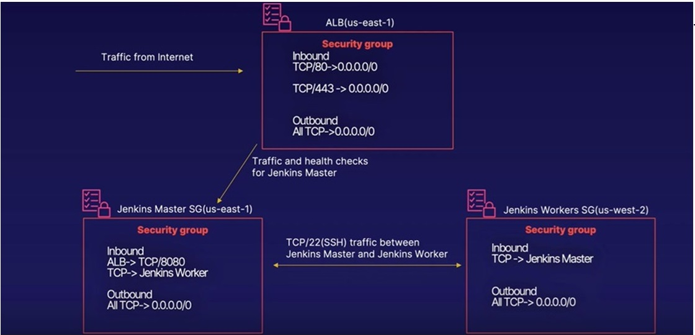
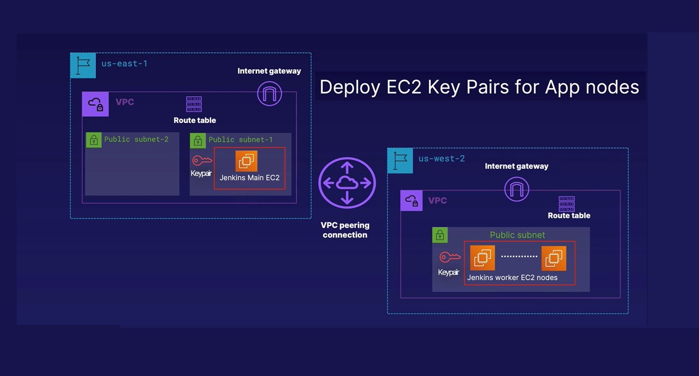
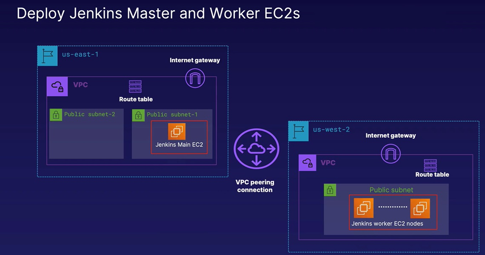
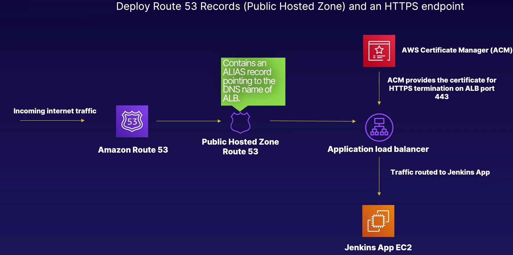
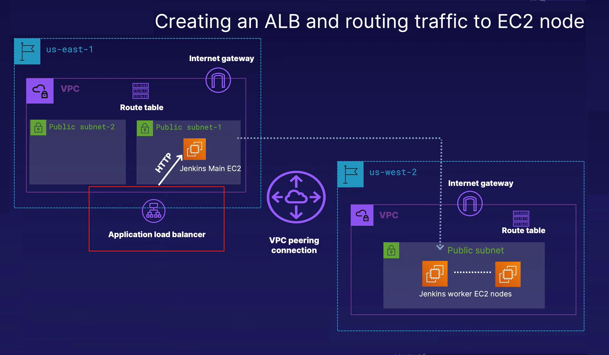

# Multi-Region Jenkins Deployment with Terraform and Ansible

This project demonstrates how to set up a multi-region Jenkins deployment across two AWS regions (us-east-1 and us-west-2) using Terraform and Ansible. The deployment includes the creation of VPCs, EC2 instances (Master and Worker nodes), security groups, an S3 backend for Terraform state, an ACM certificate for HTTPS, an Application Load Balancer (ALB), and Route 53 DNS records.

## Architecture Overview



The architecture involves two regions: 
- **us-east-1 (Master Region)** 
- **us-west-2 (Worker Region)**

In this setup, Jenkins Master is deployed in the `us-east-1` region, while Jenkins Workers are deployed in the `us-west-2` region. The setup includes high availability, with peered VPCs, a Load Balancer, and secure HTTPS endpoints.

## Steps to Deploy

Follow the steps below to set up the multi-region Jenkins deployment.

### 1. Bootstrap Terraform Controller Node
- Install Terraform, Ansible, AWS CLI, and Boto3 SDK.
- Script: `bootstrap.sh`

### 2. Configure AWS CLI
- Input AWS Access Key ID and Secret Key to configure AWS CLI.
- Script: `configure-aws.sh`

### 3. Create an S3 Bucket
- Create an S3 bucket to store Terraform state.
- Script: `createS3Bucket.sh`

### 4. Define Terraform Backend
- Configure Terraform to use the S3 bucket as a backend for state storage.
- File: `backend.tf`

### 5. Define Variables
- Define required variables for AWS regions, instance types, etc.
- File: `variables.tf`

### 6. Configure Providers for Multi-Region Deployment
- Define two AWS providers with aliases for each region.
- File: `providers.tf`

### 7. Deploy Network Layout


- Create VPCs, subnets, Internet Gateways (IGWs), and peering connections.
- Deploy routing tables and associate them with respective VPCs.
- File: `networks.tf`

### 8. Deploy Security Groups


- Create Security Groups (SGs) for Load Balancer, Jenkins Master, and Worker.
- File: `security_groups.tf`

### 9. Key Pair Generation


- Generate a compatible key pair for EC2 instances.
- Script: `key_pair_generation.sh`

### 10. Deploy EC2 Instances


- Deploy Jenkins Master in `us-east-1` and Worker nodes in `us-west-2`.
- Use a dynamic count for worker nodes based on configuration.
- File: `instances.tf`

### 11. Output EC2 Instance Information
- Define outputs to capture the public IPs of the Master and Worker nodes.
- File: `output.tf`

### 12. Configure Ansible for Configuration Management
- Set up Ansible with dynamic inventory.
- Create Ansible playbooks to install Jenkins Master and Worker nodes.
- Directory: `ansible_templates/`
- Configuration File: `inventory_aws/tf_aws_ec2.yml`
- Playbooks: `install_jenkins_master.yml` and `install_jenkins_worker.yml`

### 13. Run Ansible Playbooks for Jenkins Setup
- Use Terraform provisioners to trigger Ansible playbooks during EC2 instance provisioning.
- File: `instances.tf`

### 14. Configure Route 53 and ACM for HTTPS


- Set up a Route 53 hosted zone and configure ACM for SSL certificates.
- Create Route 53 records for domain verification and point to the ALB.
- File: `dns.tf` and `acm.tf`

### 15. Set Up Application Load Balancer (ALB)


- Deploy an ALB with listeners for HTTP (port 80) and HTTPS (port 443).
- Set up SSL termination with ACM certificate.
- Create Route 53 alias records to point to the ALB.
- File: `alb.tf`

## Prerequisites

- Terraform >= 1.x
- Ansible >= 2.9
- AWS CLI
- AWS account with the necessary permissions to create resources (VPC, EC2, Route 53, ACM, ALB)

## Setup

1. Clone this repository.
2. Configure your AWS CLI with proper credentials: `aws configure`.
3. Initialize the Terraform working directory:
   ```bash
   terraform init
