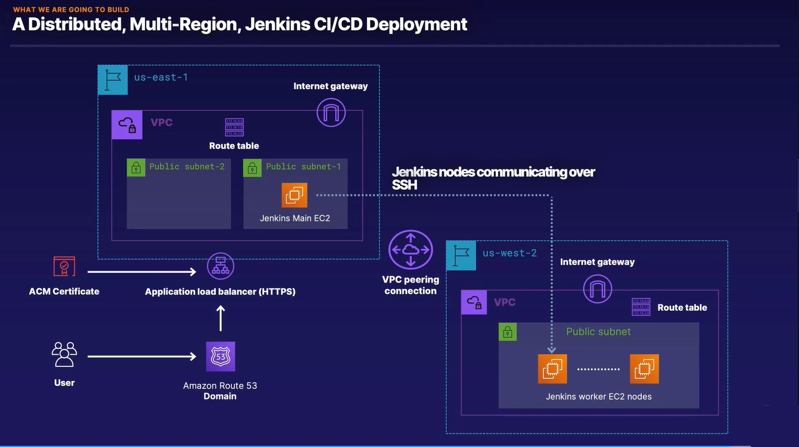
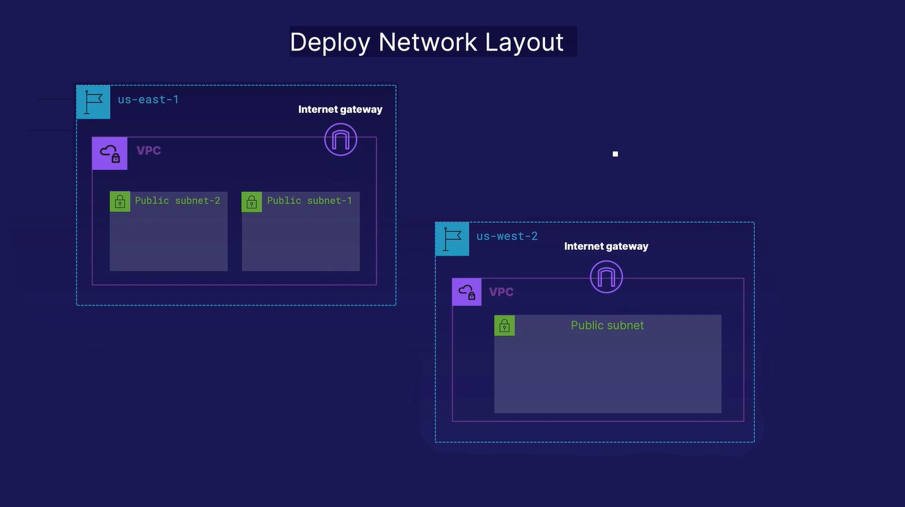
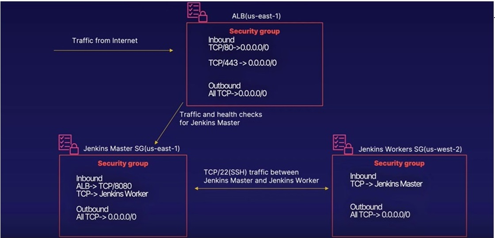
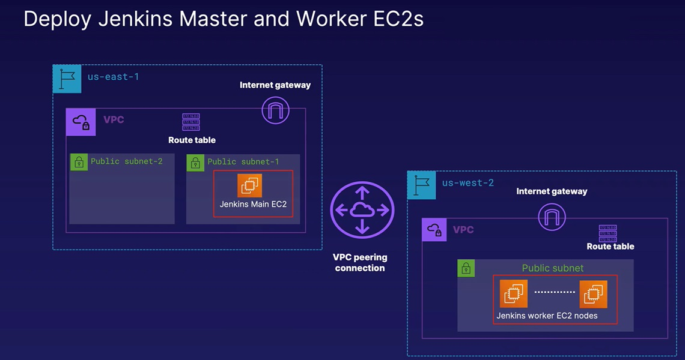
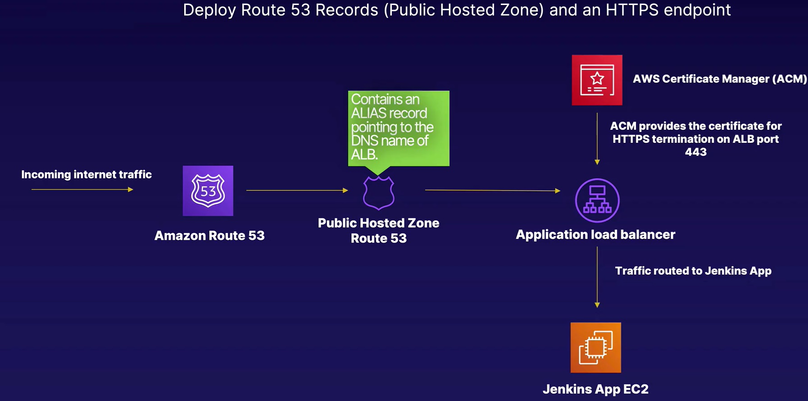
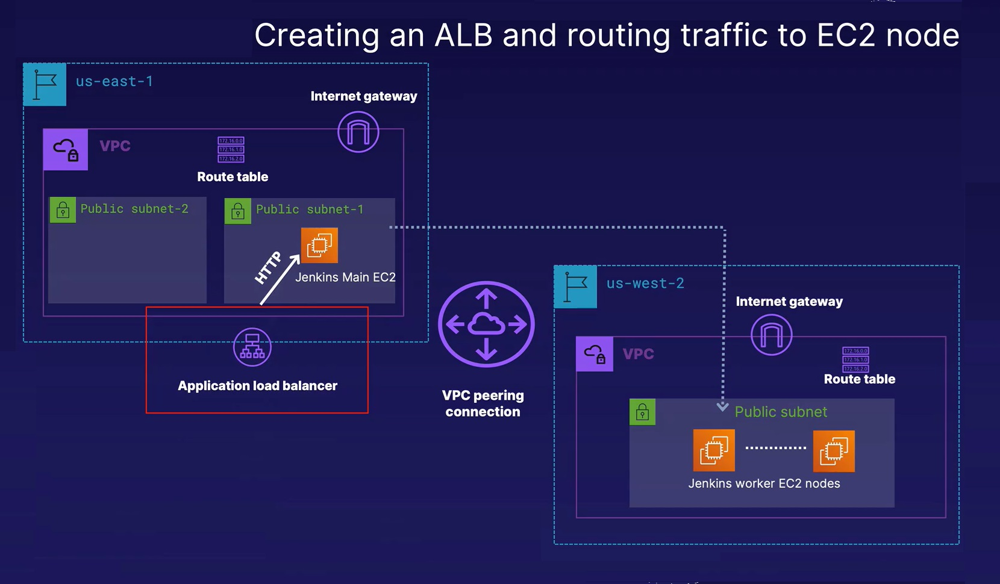

# Multi-Region Jenkins Deployment – Terraform + Ansible

A production-style Jenkins CI/CD infrastructure spanning two AWS regions, provisioned entirely with Terraform and configured with Ansible. The setup includes VPC peering, an Application Load Balancer with HTTPS, Route 53 DNS, and dynamic Ansible inventory generation.

---

## 🏗️ Architecture Overview



| Region | Role |
|---|---|
| `us-east-1` | Jenkins Master node |
| `us-west-2` | Jenkins Worker nodes |

The two regions are connected via **VPC peering**, with traffic routed through an **ALB** with TLS termination via ACM. Route 53 manages the DNS endpoint.

---

## 🛠️ Tools & Technologies

- **Terraform** — all AWS infrastructure as code
- **Ansible** — Jenkins Master and Worker installation and configuration
- **AWS** — EC2, VPC, VPC Peering, ALB, Route 53, ACM, S3, Security Groups
- **S3 backend** — remote Terraform state storage

---

## 📂 Repository Structure

```
.
├── providers.tf          # Dual-region AWS provider configuration
├── backend.tf            # S3 remote state backend
├── variables.tf          # Input variables
├── networks.tf           # VPCs, subnets, IGWs, peering, route tables
├── security_groups.tf    # Security groups for ALB, Master, Workers
├── instances.tf          # EC2 instances + Ansible provisioner triggers
├── alb.tf                # Application Load Balancer + listeners
├── acm.tf                # ACM certificate provisioning
├── dns.tf                # Route 53 hosted zone and records
├── outputs.tf            # EC2 public IPs and resource outputs
│
├── ansible_templates/    # Ansible playbooks and dynamic inventory
│   ├── install_jenkins_master.yml
│   ├── install_jenkins_worker.yml
│   └── inventory_aws/
│       └── tf_aws_ec2.yml
│
├── bootstrap.sh          # Install Terraform, Ansible, AWS CLI, Boto3
├── configure-aws.sh      # AWS CLI credential configuration
├── createS3Bucket.sh     # Create S3 bucket for Terraform state
└── GenerateKeyPair.sh    # SSH key pair generation
```

---

## 🚀 Deployment Steps

### 1. Bootstrap the Controller Node

Install Terraform, Ansible, AWS CLI, and the Boto3 SDK on your controller machine.

```bash
./bootstrap.sh
```

---

### 2. Configure AWS Credentials

```bash
aws configure
```

> ⚠️ Never pass credentials as command-line arguments — they will be stored in your shell history. Use `aws configure` or environment variables instead.

---

### 3. Create S3 Backend for Terraform State

```bash
./createS3Bucket.sh
```

Then configure the bucket name in `backend.tf`:

```hcl
terraform {
  backend "s3" {
    bucket = "<your-bucket-name>"
    key    = "jenkins/terraform.tfstate"
    region = "us-east-1"
  }
}
```

---

### 4. Deploy Network Layout



Creates VPCs in both regions, public subnets, Internet Gateways, VPC peering connection, and route tables.

```bash
terraform init
terraform apply -target=module.networks
```

---

### 5. Deploy Security Groups



Security groups for the ALB, Jenkins Master, and Worker nodes with least-privilege ingress rules.

```bash
terraform apply -target=module.security_groups
```

---

### 6. Generate SSH Key Pair

```bash
./GenerateKeyPair.sh
```

---

### 7. Deploy EC2 Instances



Deploys Jenkins Master in `us-east-1` and Worker nodes in `us-west-2`. Worker count is configurable via `variables.tf`. Terraform provisioners trigger Ansible playbooks automatically on instance creation.

```bash
terraform apply -target=module.instances
```

---

### 8. Configure Route 53 and ACM



Provisions an ACM certificate, validates via DNS, and creates Route 53 records pointing to the ALB.

```bash
terraform apply -target=module.dns
terraform apply -target=module.acm
```

---

### 9. Deploy Application Load Balancer



Creates the ALB with HTTP (port 80) and HTTPS (port 443) listeners. SSL termination handled by ACM. Route 53 alias record points to the ALB DNS name.

```bash
terraform apply -target=module.alb
```

---

### 10. Full Deployment (All at Once)

```bash
terraform apply
```

---

## ⚙️ Key Design Decisions

- **Dual-region providers:** Terraform uses provider aliases to manage resources in `us-east-1` and `us-west-2` within a single configuration
- **VPC peering:** Enables private communication between Master and Worker nodes across regions without traffic traversing the public internet
- **Dynamic Ansible inventory:** `tf_aws_ec2.yml` uses the AWS EC2 plugin to discover instances automatically — no manual IP management
- **Terraform provisioners:** Ansible playbooks are triggered directly from `instances.tf` on resource creation, keeping infrastructure and configuration in sync
- **S3 remote state:** Enables team collaboration and prevents state file conflicts

---

## 📦 Prerequisites

- Terraform >= 1.x
- Ansible >= 2.9
- AWS CLI configured
- AWS account with permissions for EC2, VPC, ALB, Route 53, ACM, S3
- A registered domain for Route 53 + ACM validation

---

## 🧹 Teardown

```bash
terraform destroy
```

---

## 📘 What This Project Demonstrates

- Multi-region AWS infrastructure with Terraform provider aliases
- VPC peering for cross-region private networking
- Jenkins Master/Worker architecture at scale
- ALB with TLS termination and Route 53 DNS integration
- Dynamic Ansible inventory from live AWS infrastructure
- Remote Terraform state management with S3
