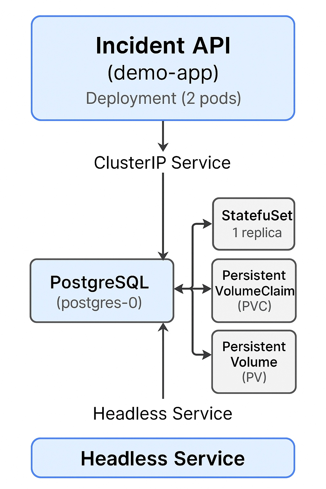

# Incident Tracker – Kubernetes + Postgres + Helm Deployment

A production-style Kubernetes deployment of an Incident Tracker API backed by PostgreSQL. This project demonstrates key DevOps and platform engineering skills including stateful workloads, Helm chart design, persistent storage, and application configuration management.

---

## 🏗️ Architecture Overview



| Component | Description |
|---|---|
| `demo-app` | Node.js API providing `/health`, `/incidents` endpoints |
| Deployment | 2 replicas, liveness/readiness probes, resource requests/limits |
| ConfigMap | Database host, port, name, and user |
| Secret | Encoded DB credentials |
| `postgres` | StatefulSet with persistent storage |
| Headless Service | Stable network identity for Postgres |
| PV/PVC | 1Gi persistent storage for DB data |
| Helm Chart | Generates all manifests from configurable values |

---

## 🚀 Features Demonstrated

- Helm templating for multi-tier applications
- Kubernetes StatefulSet with persistent storage
- Liveness & readiness probes with tuned thresholds
- Resource requests & limits on all containers
- Configuration via ConfigMaps & Secrets
- Internal service-to-service communication
- Fully reproducible deployment via Helm

---

## 📂 Repository Structure

```
.
├── app/
│   ├── index.js          # Node.js Express API
│   ├── Dockerfile        # App container image
│   └── package.json
├── helm/
│   └── incident-tracker/
│       ├── Chart.yaml
│       ├── values.yaml
│       └── templates/
│           ├── deployment.yaml
│           ├── service.yaml
│           ├── configmap.yaml
│           ├── postgres-statefulset.yaml
│           ├── postgres-service.yaml
│           ├── postgres-secret.yaml
│           ├── postgres-pv.yaml
│           └── postgres-pvc.yaml
├── k8s-manifests/        # Raw manifests (pre-Helm reference)
└── images/
    └── IncidentTrackerDiagram.png
```

---

## 📦 Prerequisites

- Kubernetes cluster (minikube, kind, or multi-node)
- `kubectl` installed and configured
- `helm` v3 installed
- Docker (to build and push the app image)

---

## 🔧 Deployment Instructions

### 1. Build & Push the App Image

```bash
cd app/
docker build -t <your-dockerhub-username>/incident-api:v1 .
docker push <your-dockerhub-username>/incident-api:v1
```

Update the image reference in `helm/incident-tracker/values.yaml`:

```yaml
appDeployment:
  containers:
    image:
      release: <your-dockerhub-username>/incident-api
      version: v1
```

### 2. Deploy Using Helm

```bash
cd helm/incident-tracker
helm upgrade --install incident-tracker-v1 . \
  --namespace demo-ha-app \
  --create-namespace
```

### 3. Verify the Deployment

```bash
kubectl get all -n demo-ha-app
kubectl get pv,pvc
```

You should see:
- Deployment with 2 running pods
- StatefulSet with 1 pod
- Services for `demo-app` and `postgres`
- PV + PVC in `Bound` state

---

## 🧪 Testing the Application

### Start a temporary curl client inside the cluster

```bash
kubectl run curl-client \
  -n demo-ha-app \
  --restart=Never \
  --image=curlimages/curl \
  --command -- sleep 3600
```

### Check API health

```bash
kubectl exec -it curl-client -n demo-ha-app -- \
  curl -sS http://demo-app/health
```

Expected output:
```json
{"status":"ok"}
```

### Fetch incidents

```bash
kubectl exec -it curl-client -n demo-ha-app -- \
  curl -sS http://demo-app/incidents
```

### Create an incident

```bash
kubectl exec -it curl-client -n demo-ha-app -- \
  curl -sS -X POST http://demo-app/incidents \
  -H "Content-Type: application/json" \
  -d '{"title":"DB latency spike","severity":"high"}'
```

---

## 🧹 Cleanup

```bash
helm uninstall incident-tracker-v1 -n demo-ha-app
kubectl delete namespace demo-ha-app
```

---

## 📘 Future Enhancements

- [ ] Add `NetworkPolicy` to restrict DB access to app only
- [ ] Add `HorizontalPodAutoscaler` for `demo-app`
- [ ] Add Ingress + TLS termination
- [ ] Add CI/CD pipeline to lint, package, and deploy the Helm chart
- [ ] Add automated backup `CronJob` for Postgres

---

## 🏁 Summary

This project demonstrates practical, production-grade Kubernetes deployment skills across the full stack — from containerized application code to Helm-packaged infrastructure, persistent stateful workloads, and operational readiness through health checks and resource management.
